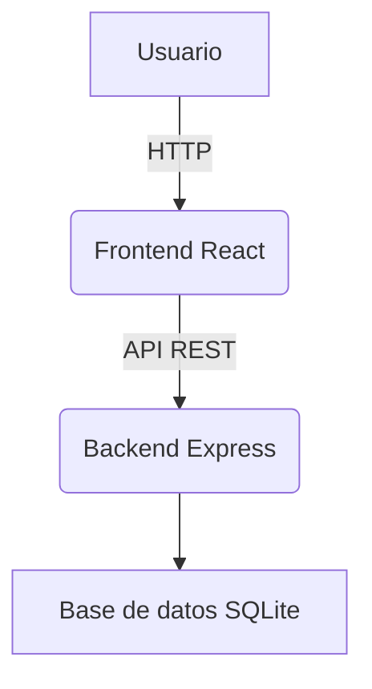

# Clean Cut - Link Shortener

Bienvenido a la documentación de Clean Cut, tu acortador de enlaces full stack. Aquí encontrarás información sobre la arquitectura, el flujo de la app, cómo contribuir y mucho más.

## ¿Qué es Clean Cut?

Clean Cut es una aplicación web que permite acortar, compartir y gestionar enlaces de manera sencilla y segura. Incluye autenticación, gestión de usuarios, animaciones y una experiencia moderna tanto en frontend como en backend.

---

## Índice rápido

- [Arquitectura general](architecture.md)
- [Frontend](frontend.md)
- [Backend](backend.md)
- [API](api.md)
- [Preguntas frecuentes](faq.md)

# Arquitectura del Proyecto

El proyecto está dividido en dos grandes partes:

- **Frontend:** SPA en React, usando Vite, TailwindCSS y React Router.
- **Backend:** API RESTful en Node.js/Express, con autenticación JWT y base de datos SQLite.

## Diagrama general

## Flujo básico

1. El usuario interactúa con la app en React.
2. El frontend hace peticiones a la API del backend.
3. El backend responde, accediendo a la base de datos si es necesario.
4. El frontend muestra los resultados y actualiza la UI.
